# CH2 Divide and Conquer

# 1. Maxima in the Plane

## 1.1 Problem Description

Consider a set of $n$ 2-D points:

```math
P=\{p_{1}, p_{2}, \cdots, p_{n}\}
```

where each point is represented by its $x$ and $y$ coordinate:

```math
p_{i} = (x_{i}, y_{i}), \ i \in [0, n]
```

**`local def`** We define that $p_{i}$ **dominates** $p_{j}$ if:

```math
x_{i} > y_{i} \land x_{j} > y_{j}
```

**`local def` Maxima**

The **Maxima** is a subset of $P$ where every point in the Maxima is not dominated by other points.

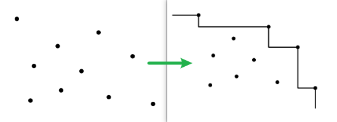

**`goal`** Given such set of 2-D points $P$, we want to find its Maxima.

## 1.2 Problem Solution

We divide the $n$ points into arbitrarily two halves. Suppose that we obtained both halves' Maxima. We now merge the two solutions.

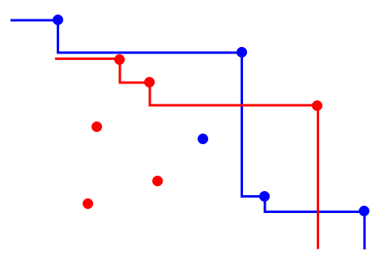

<br>

<html>
    <table>
        <tr>
            <th>Graph</th>
            <th>Description</th>
        </tr>
        <tr>
            <td>
                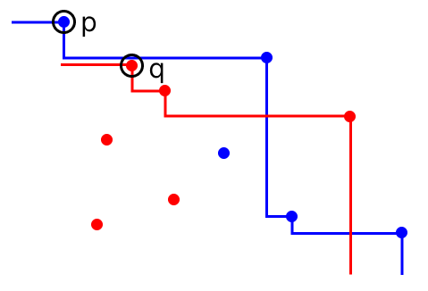
            </td>
            <td style="max-width:200px">
                First, p and q relatively points to the leftmost maxima of blue and red. We can safely declare that the blue one is the overall maxima.
            </td>
        </tr>
        <tr>
            <td>
            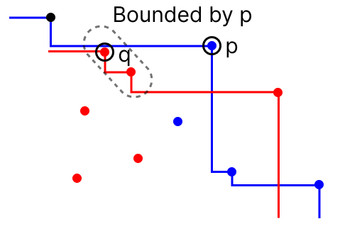
            </td>
            <td style="max-width:200px">
                Pointer p proceeds, finding that the first and second points in the red set are bounded by p. Therefore, this p is the overall Maxima.
            </td>
        </tr>
        <tr>
            <td>
            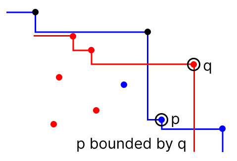
            </td>
            <td style="max-width:200px">
                Now, p is bounded by q. Therefore, q is the overall maxima.
            </td>
        </tr>
        <tr>
            <td>
            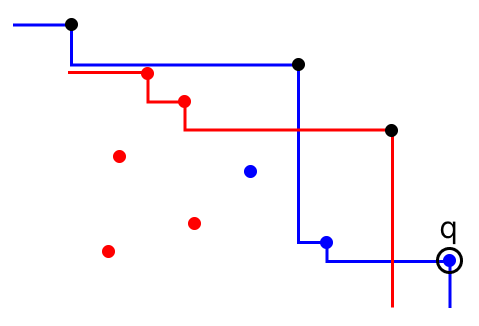
            </td>
            <td style="max-width:200px">
                No more p. Then q is the overall maxima.
            </td>
        </tr>
    </table>
</html>

## 1.3 Complexity

Merging takes $O(n)$ time. Therefore, we have the following recurrence:

```math
T(n) \leq \underbrace{2 \cdot T(\frac{n}{2})}_{\text{Each part}} + \underbrace{O(n)}_{\text{Merge}}
```

Namely, $T(n) = O(n \log n)$

# 2. Closest Pair in the Plane

## 2.1 Problem Description

Consider the point set $P$ given in the first problem.

**`local def`** We define that, $p_{i}$ and $p_{j}$ is the **closest pair** if the distance between them is the minimum among all distinct pairs of input points. Namely:

```math
\neg \exists a, b, \  \text{dist}(p_{i}, p_{j}) > \text{dist}(p_{a}, p_{b})
```

**`goal`** Given such set of 2-D points $P$, find the closest pair $(p_{i}, p_{j})$.

## 2.2 Problem Solution

Suppose we have found the closest pair $(p_{i}, p_{j})$ in the leftmost and rightmost $\frac{n}{2}$ points, respectively. 

```math
\delta_{1}, \delta_{2}
```

We now merge the two solutions.

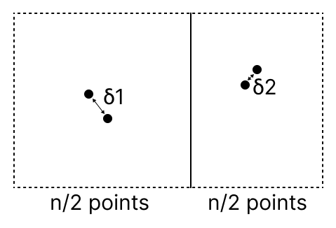

<br>

We now need to identify, whether there exists a pair of points with a smaller distance than $\delta_{1}$ and $\delta_{2}$, where each point belongs to different sub-sets.

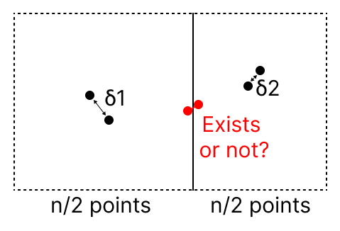

<br>

### 2.2.1 Limit $x$ Coordinate

We identify the smaller distance among the two obtained solutions.

```math
\delta = \min(\delta_{1}, \delta_{2})
```

We put a two-way limit with width $2\delta$ evenly around the division point of the left and right sub-sets. Now, only points within the middle region is worthy of inspecting.

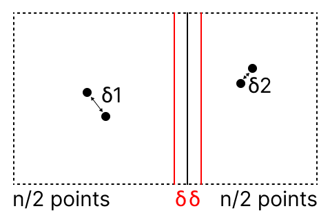

<br>

If any of the point of the inspected cross-set pair is out of this region, the $x$ distance will already be larger than $\delta$, making it useless.

### 2.2.2 Limit $y$ Coordinate

`sub-figure (a)` For an arbitrary point within the delta-region, we put a two-way limit with height $2\delta$ around the $x$ axis of that point evenly.

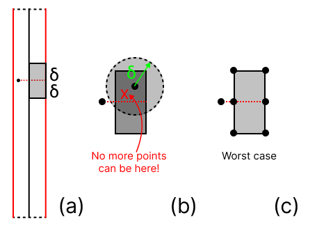

<br>

For this point specifically. Any point out of this region is useless, since its $y$ distance will already be larger than $\delta$. The pairing point should always lie in the gray area.

**`fact`** *(c)* The gray area can have atmost 6 points. There are $O(1)$ points inside the gray rectangle.

**`informal-proof`** *(b)* If we have a point in an arbitrary region in the gray area, there will be no points within a dashed-circle of radius $\delta$ from it. Otherwise, the distance between the second point to the circle's center will be smaller than $\delta$, leading to a contradiction.

### 2.2.3 Two Scans

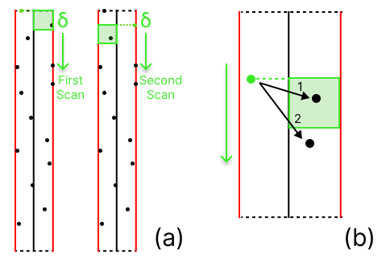

<br>

There are two top-to-bottom scans from the left to the right.

Take the first scan as an example, where left points are iterated to scan the right points. At each left point, scan the right list from the current position until the next point falls out the gray square. This takes $O(1)$ time.

> Notice that, since we will use right points to scan the left bottom as well, we don't scan the top square during the left-scan.

Both scans have at most $O(\frac{n}{2})$, so the scanning time is $O(n)$.

## 2.3 Complexity

At each stage, we:

- Make two recursive calls to obtain the left and right minimum distances.
- Spend $O(n\log n)$ to sort all the points.
- Spend $O(n)$ time to scan the boundary.

In summary, each recursive call takes $O(n\log n)$ time.

Consequently, the overall recurrence is:

```math
T(n) \leq 2T(\frac{n}{2}) + O(n\log n)
```

Leading to $T(n) = O(n (\log n)^{2})$.

## 2.4 Enhance Sorting

We don't need to sort the points at every recursive call. We can sort them once in for all.

Sort the points into unified two doubly-linked lists with respect to the $x$ and $y$ coordinates.

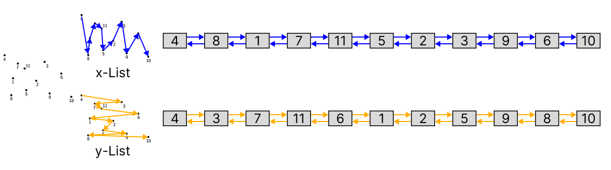

<br>

*(The respective link view.)*

<br>

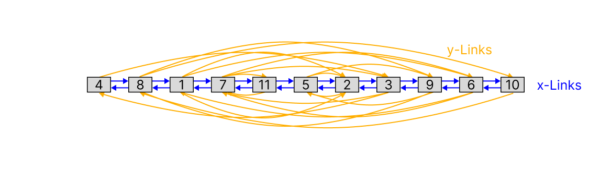

<br>

*(The true, unified link view, in x-perspective.)*

## 2.5 Complexity After Enhancement

Initially:

- We sort the points twice in $O(n \log n)$ time.

At each recursive call, we:

- Scan through the $x$ - List from the middle to filter out middle points, in $O(n)$ time.
- For left and right subset within the middle area, we use cross-reference pointers to get their $y$ orders, in $O(n)$ time. 
- We then scan the middle area twice, in $O(n)$ time.

In summary, each recursive call takes $O(n)$ time.

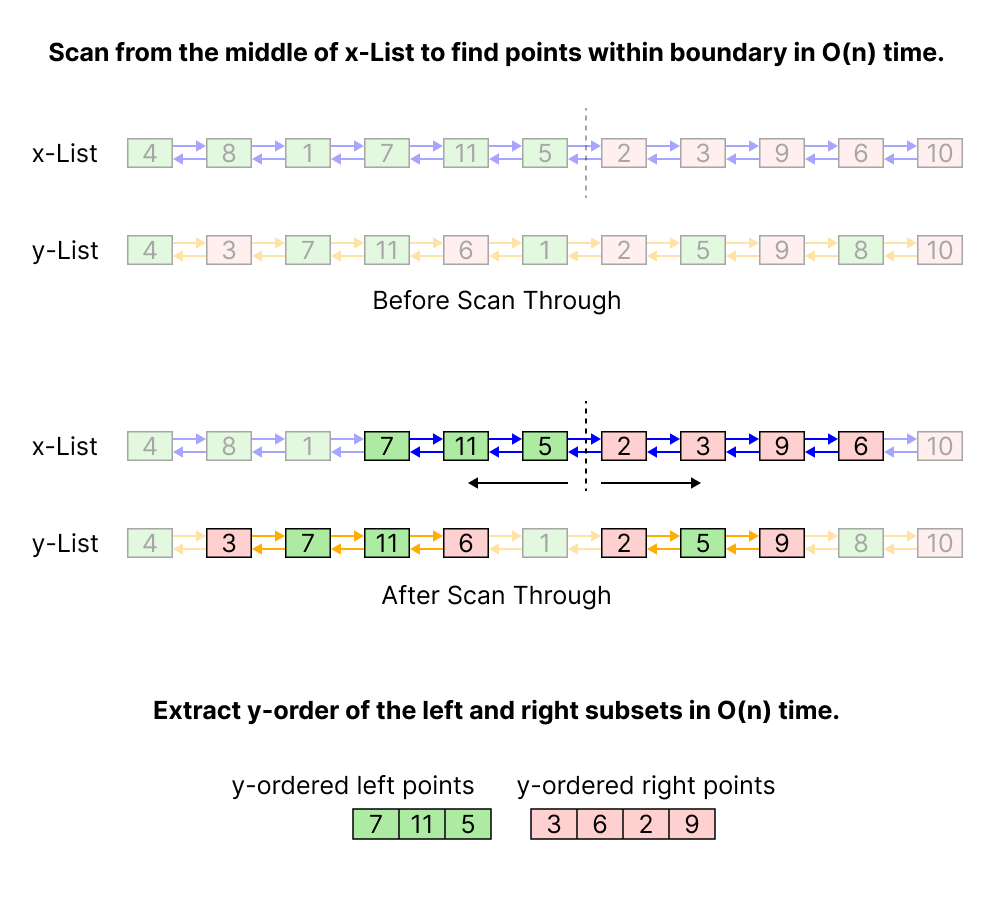

<br>

Consequently, ignoring the cost of sorting, the overall recurrence is:

```math
T(n) \leq 2 \cdot T(\frac{n}{2}) + O(n)
```

Resulting in $T(n) = O(n \log n)$. This still remains after the initial sorting cost is added since:

```math
\begin{align}
T(n) + O(n \log n) &= 2 \cdot O(n \log n) \\
&= O(n \log n)
\end{align}
```

# 3. k-th Smallest Number

## 3.1 Problem Description

**`given`**

1. $n$ sorted numbers:

```math
x_{1}, x_{2}, \cdots, x_{n}
```

2. An inter $k$, where:

```math
k \in [1, n]
```

**`goal`** Output the $k$-th smallest number.

## 3.2 Problem Solution

**`example`**

- $A = [5, 10, 1, 6, 13, 11, 9, 4, 8, 7, 3, 12, 2], \ n=13$
- $k = 5$

---

**`algorithm`** SelectKth

**Step 1.** Find a random pivot $p$ in $A$, in $O(1)$ time.

- For instance, pick $p=6$.

**Step 2.** Partition $A$ into left and right parts, where all the left parts $< 6$ and all the right parts $\geq 6$, in $O(n)$ time.

```math
\underbrace{2, 3, 1, 5, 4}_{\leq\text{6, size} = 5}, \underbrace{11, 9, 13, 8, 7, 10, 12, 6}_{\geq\text{6, size = } 8}
```

**Step 3.** Recursively find the element.

- If $k \leq 5$, we recursively find the $k$-th smallest number in the left subarray.
- If $k > 5$, we recursively find the $(k - 5)$-th smallest number in the right subarray.

---

**`pseudocode`** SelectKth $(A, p, r, k)$

1. If $p$ = $r$, return $A[p]$.
2. $j$ := Partition($A$, $p$, $r$);
3. If $k \leq (j - p + 1)$ then SelectKth $(A, p, j, k)$;
4. Otherwise, SelectKth $\Bigl(A, j+1, r, k-(j-p+1)\Bigr)$

## 3.3 Complexity

**`analysis`** The worst-case would be that, at each recursive call, the called pivot is always the smallest.

```math
\begin{align}

\underbrace{3, }_{\leq 3}\underbrace{6, 13, 11, 9, 4, 8, 7, 5, 12, 10}_{> 3} & \ (p=3) \\

\underbrace{4, }_{\leq 4}\underbrace{13, 11, 9, 6, 8, 7, 5, 12, 10}_{> 4} & \ (p=4) \\

\underbrace{5, }_{\leq 5}\underbrace{11, 9, 6, 8, 7, 13, 12, 10}_{> 5} & \ (p=5) \\

\cdots &

\end{align}
```

In this case, each recursive call only eliminates 1 elment, resulting the recurrence of:

```math
T(n) \leq T(n-1) + O(n)
```

Which results in: $T(n) = O(n^2)$.

## 3.4 Enhance Pivot Selection

### 3.4.1 Foundational Theory

The idea is to enforce a more balanced partition. If we can force each split to have an $\alpha : 1-\alpha$ ratio for some $\alpha \in [\frac{1}{2}, 1)$. In this case, the recurrence would be:

```math
T(n) \leq T(\alpha n) + O(n)
```

Expanding it by:

```math
\begin{align}
T(n) &\leq T(\alpha n) + O(n) \\

&\leq \Bigl(T(\alpha^{2} n) + O(\alpha n)\Bigl) + O(n) \\

&= T(\alpha^{2} n) + O(\alpha n) + O(n) \\

&\leq T(\alpha^{3} n) + O(\alpha^{2} n) + O(\alpha n) + O(n) \\

&\leq \cdots \\

&\leq T(\alpha^{\infty} n) + O(n \cdot \sum_{i=1}^{\infty}\alpha^{i}) \\

&= T(1) + O(\frac{n}{1-\alpha}) \\

&\leq O(n)

\end{align}
```

*Remark* The geometric series:

```math
\sum_{i=1}^{\infty} \alpha^{i} = \frac{1}{1-\alpha}, \ \alpha \in (0,1)
```

### 3.4.2 Implementation: Median of Medians

---

**`pseudocode`** SelectKth $(A, p, r, k)$

1. If $p=r$, return $A[p]$.
2. $m$ := MedianOfMedians $(A, r)$;  `// only change`
3. If $k \leq (m-p+1)$ then SelectKth $(A, p, m, k)$;
4. Otherwise, SelectKth $\Bigl(A, m+1, r, k-(m-p+1)\Bigr)$;

---

**`algorithm`** MedianOfMedians

**Step 1.** First, partition the array $A$ into sub-arrays of size $5$.

**Step 2.** For each sub-array: 

- Find the median in $O(1)$ time.
- Put the median into a set $B$.

**Step 3.** Select the $\frac{|A|}{10}$ - th smallest from $B$ as $M$, in $T(\frac{n}{5})$ time.

**Step 4.** Output $M$. 

---

**`analysis`**

*(c)* At least $\frac{n}{4}$ numbers are $\geq m$, at least $\frac{n}{4}$ numbers are $\leq m$. Therefore, the maximum possible size of the left and right array is $\frac{3n}{4}$.

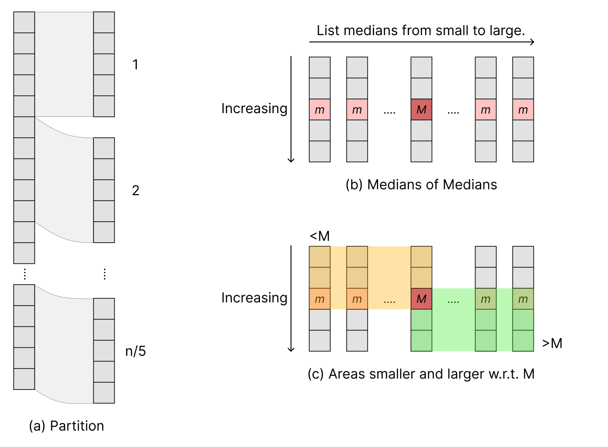

<br>

---

## 3.5 Complexity after Enhancement

At each recursive call:

- MediansOfMedians runs in $T(\frac{n}{5})+O(n)$ time.
- Recursive call runs in $T(\frac{3n}{4}) + O(n)$ time.

Therefore, the recurrence is:

```math
T(n) \leq \underbrace{T(\frac{n}{5})}_{\text{MoM}} + \underbrace{T(\frac{3n}{4}) + O(n)}_{\text{Recursive Calls}}
```

An informal evaluation:

```math
\begin{align}

T(n) &\leq T(\frac{n}{5}) + T(\frac{3n}{4}) + O(n) \\

&= T(\frac{n}{5} + \frac{3n}{4}) + O(n) \\

&= T(\frac{19}{20}n) + O(n) \\

&\leq T \Bigl((\frac{19}{20})^{2} n\Bigr) + O(\frac{19}{20} n) + O(n) \\

&\leq \cdots \\

&\leq T(1) + O(\frac{n}{1-\frac{19}{20}}) \\

&\leq O(n)

\end{align}
```

After enhancements, the complexity of finding the k-th smallest element is $O(n)$, which is the same as finding the smallest element.
