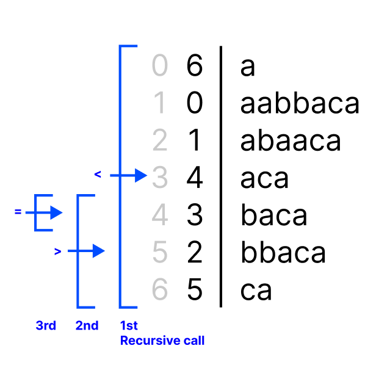
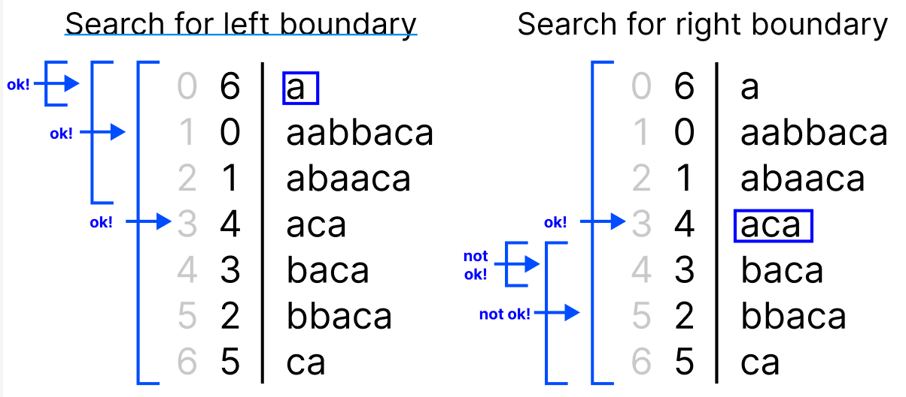

# CH 3 String Searching

# 1. Basics

**`def` Alphabet**

The alphabet (denoted by $\Sigma$) is a finite set of symbols. `e.g.` English alphabet.

**`def` String Searching**

- Input: A text $T$ of length $n$.
- Output: A data structure.

The data structure's feature:

- Input: A query pattern $P$ of length $m$.
- Output: Locate $P$ in $T$.
    - Quickly, without the need of reading all $T$'s symbols.

# 2. Suffix Array: Basics and Usage

## 2.1 Basics

Given an input string (i.e., array) $T$ of length $n$.

| 0 | 1 | 2 | 3 | 4 | 5 | 6 |
|---|---|---|---|---|---|---|
| a | a | b | b | a | c | a |

$T$ contains $n$ symbols, therefore it has $n$ suffixes.

| i | suffix |
|--|--|
| 0 | a |
| 1 | ca |
| 2 | aca |
| 3 | baca |
| 4 | bbaca | 
| 5 | abbaca |
| 6 | aabbaca |

Somehow, by magic, put them in lexiographic order.

Order | i | suffix |
|--|--|--|
| 0 | 6 | a |
| 1 | 0 | aabbaca |
| 2 | 1 | abbaca |
| 3 | 4 | aca |
| 4 | 3 | baca |
| 5 | 2 | bbaca |
| 6 | 5 | ca | 

The second column (with header `i`) is the suffix array.

| `j` | 0 | 1 | 2 | 3 | 4 | 5 | 6 |
|---|---|---|---|---|---|---|---|
| `SA[j]` | 6 | 0 | 1 | 4 | 3 | 2 | 5 |

`SA[j]` denotes the starting point of the `j`-th suffix in the suffix array.

## 2.2 Decide if pattern $P$ is in template $T$

Given a template $T$ of length $n$ and a pattern $P$ of length $m$. If $P$ is in $T$, then $P$ must be a prefix of a specific suffix of $T$.

Since the suffix array is sorted in lexiographical order, we can use **binary search** to find the specific suffix.

`e.g.`

- $T$ = `aabbaca`
- $P$ = `ab`



**`Complexity`** At each recursive call, we compare the corresponding substring `T[SA[j]:n-1]` with $P$ in $O(m)$ time. Therefore, the recurrence is $T(n) \leq T(\frac{n}{2}) + O(m)$, resulting in a total $O(m\log n)$ complexity.

## 2.3 Find all $P$'s occurrences in $T$

Different occurrences of $P$ = Multiple suffixes in $T$ that shares the same prefix (which is $P$). These suffixes must appear in **consecutive locations** in the suffix array.

Issue two binary searches to search for the left and right boundaries.

`e.g.`

- $T$ = `aabbaca`
- $P$ = `a`



At each recursive call at the left-boundary search:

- Compare the pattern $P$ with the current suffix `T[SA[j]:n-1]`.
- If $P$ is fully matched, then the left boundary may be lefter, recurse the left part.
- Otherwise, the left boundary may be righter, recurse the right part.

Same for right-boundary search.

**`Complexity`** Both binary searches are in $O(m\log n)$ time. The time complexity is $O(m \log n + k)$, where $k$ is the number of occurrences of $P$ in $T$.

# 3. Suffix Array: Construction

## 3.1 Problems

A string $T$ of length $n$ has $n$ suffixes, half of which are over length $\frac{n}{2}$. For an optimal sotring algorithm, we'll make $O(n \log n)$ comparisons. For each comparison, the time complexity is $O(n)$. Therefore, the time complexity is $O(n^2 \log n)$.

The key problem is the comparison, which takes $O(n)$ time. We'll instead invent a "Rank", where:

- String $\alpha <$ String $\beta \iff$ Rank($\alpha$) $<$ Rank($\beta$).
- Comparison of two ranks are better than $O(n)$.

## 3.2 Construction Algorithm

We use a bottom-up manner to construct the suffix array. We compute the rank of length $2^{0}$ first, and then for length $2^{1}$, and then for length $2^{2}$, and so on.

`e.g.` An example of the template string $T$:

| 0 | 1 | 2 | 3 | 4 | 5 | 6 | 7 |
|---|---|---|---|---|---|---|---|
| a | a | b | b | a | c | a | \$|

### 3.2.1 Overall Steps

#### 3.2.1.1 Base Case

For each symbol `T[i]`, we create an ordered pair `(T[i], i)`. 

Regard the `T[i]` as a number ordered by the lexiographic order. For English alphabet, the number is the ASCII code (anything is ok). Sort the tuple by:

1. Compare the symbols.
2. If the symbols are the same, compare the indices.

| Rank | Rank Tuple |
|------|------------|
| 1 | `($, 7)` |
| 2 | `(a, 0)` |
| 2 | `(a, 1)` |
| 2 | `(a, 3)` |
| 2 | `(a, 5)` |
| 6 | `(b, 2)` |
| 6 | `(b, 3)` |
| 8 | `(c, 5)` |

#### 3.2.1.2 Length $2^{1}$ case

**Step 1.** Traverse the array to get all length-2 substrings, and obtain the ranks of the left and right sub-symbols. 

**Step 2.** Sort the rank tuples using the first-and-then-second order. 

- Again, if there are two same substrings, they share the same rank. The rank of the one after the last same substring will receive a cumulative increase (see 3.2.1, this stage did not show this property).

<table>
<tr>
    <th>Before</th>
    <th>After</th>
</tr>
<tr><td>

| Substring | Rank Tuple | Pos |
|-----------|------------|-----|
| `aa` | `(2, 2)` | 0 |
| `ab` | `(2, 6)` | 1 |
| `bb` | `(6, 6)` | 2 |
| `ba` | `(6, 2)` | 3 |
| `ac` | `(2, 8)` | 4 |
| `ca` | `(8, 2)` | 5 |
| `a$` | `(2, 1)` | 6 |
| `$$` | `(1, 1)` | 7 |

</td><td>

| Rank | Substring | Rank Tuple |
|------|-----------|------------|
| 1 | `$$` | `(1, 1)` |
| 2 | `a$` | `(2, 1)` |
| 3 | `aa` | `(2, 2)` |
| 4 | `ab` | `(2, 6)` |
| 5 | `ac` | `(2, 8)` |
| 6 | `ba` | `(6, 2)` |
| 7 | `bb` | `(6, 6)` |
| 8 | `ca` | `(8, 2)` |

</td></tr>
</table>

#### 3.2.1.3 Length $2^{2}$ case

**Step 1.** Traverse the array to get all length-4 substrings, and obtain the ranks of the left and right sub-strings.

- For instance, the rank tuple of `aabb` is `(X, Y)`, where `X` is the rank of the left sub-string `aa`, and `Y` is the rank of the right sub-string `bb`.

**Step 2.** Sort the rank tuples using the first-and-then-second order.

<table>
<tr>
    <th>Before</th>
    <th>After</th>
</tr>
<tr><td>

| Substring | Rank Tuple | Pos |
|-----------|------------|-----|
| `aabb` | `(2, 6)` | 0 |
| `abba` | `(3, 5)` | 1 |
| `bbac` | `(6, 4)` | 2 |
| `baca` | `(5, 7)` | 3 |
| `aca$` | `(4, 1)` | 4 |
| `ca$$` | `(8, 1)` | 5 |
| `a$$$` | `(2, 1)` | 6 |
| `$$$$` | `(1, 1)` | 7 |

</td><td>

| Rank | Substring | Rank Tuple |
|------|-----------|------------|
| 1 | `$$$$` | `(1, 1)` |
| 2 | `a$$$` | `(2, 1)` |
| 3 | `aabb` | `(2, 6)` |
| 4 | `abba` | `(3, 5)` |
| 5 | `aca$` | `(4, 1)` |
| 6 | `baca` | `(5, 7)` |
| 7 | `bbac` | `(6, 4)` |
| 8 | `ca$$` | `(8, 1)` |

</td></tr>
</table>

#### 3.2.1.4 Length $2^{3}$ case

<table>
<tr>
    <th>Before</th>
    <th>After</th>
</tr>
<tr><td>

| Substring | Rank Tuple | Pos |
|-----------|------------|-----|
| `aabbaca$` | `(3, 5)` | 0 |
| `abbaca$$` | `(4, 8)` | 1 |
| `bbaca$$$` | `(7, 2)` | 2 |
| `baca$$$$` | `(6, 1)` | 3 |
| `aca$$$$$` | `(5, 1)` | 4 |
| `ca$$$$$$` | `(8, 1)` | 5 |
| `a$$$$$$$` | `(2, 1)` | 6 |
| `$$$$$$$$` | `(1, 1)` | 7 |

</td><td>

| Rank | Substring | Rank Tuple |
|------|-----------|------------|
| 1 | `$$$$$$$$` | `(1, 1)` |
| 2 | `a$$$$$$$` | `(2, 1)` |
| 3 | `aabbaca$` | `(3, 5)` |
| 4 | `abbaca$$` | `(4, 8)` |
| 5 | `aca$$$$$` | `(5, 1)` |
| 6 | `baca$$$$` | `(6, 1)` |
| 7 | `bbaca$$$` | `(7, 2)` |
| 8 | `ca$$$$$$` | `(8, 1)` |

</td></tr>
</table>

This finalizes the construction of the suffix array.


### 3.2.2 Tuple Sorting Task

After each stage, we sort the previous stage's rank tuples to produce this stage's rank. We use radix sort to sort tuples in $O(n)$ time.

Every stage has $n$ tuples to sort. At a specific stage, we receives an array of tuples, in the template string's order.

`e.g.`

```python
T_order = [(3, 5), (4, 8), (7, 2), (6, 1), (5, 1), (8, 1), (2, 1), (1, 1)]
```

#### 3.2.2.0 Preparation Stage

Initialize an empty array $C_{0}$ of length $n$, each element is a null pointer.

<table>
    <tr>
        <th style="vertical-align: top;">0</th>
        <th style="vertical-align: top;">1</th>
        <th style="vertical-align: top;">2</th>
        <th style="vertical-align: top;">3</th>
        <th style="vertical-align: top;">4</th>
        <th style="vertical-align: top;">5</th>
        <th style="vertical-align: top;">6</th>
        <th style="vertical-align: top;">7</th>
        <th style="vertical-align: top;">8</th>
    </tr>
    <tr>
        <td><code>Null</code></td>
        <td><code>Null</code></td>
        <td><code>Null</code></td>
        <td><code>Null</code></td>
        <td><code>Null</code></td>
        <td><code>Null</code></td>
        <td><code>Null</code></td>
        <td><code>Null</code></td>
        <td><code>Null</code></td>
    </tr>
</table>

#### 3.2.2.1 Stage 1

Scan through the original list of tuple. For each tuple, inspect the second element, and put the tuple into the corresponding position in $C_{0}$. This tuple is actually a link node.

- For instance, if a tuple is `(3, 5)`, put the tuple into the 5th position in $C$. i.e., `C_0[5] := (3, 5)`.

If a position in the array is already taken, let the occupying link node point to the incoming tuple, and so on.

<table>
    <tr>
        <th style="vertical-align: top;">0</th>
        <th style="vertical-align: top;">1</th>
        <th style="vertical-align: top;">2</th>
        <th style="vertical-align: top;">3</th>
        <th style="vertical-align: top;">4</th>
        <th style="vertical-align: top;">5</th>
        <th style="vertical-align: top;">6</th>
        <th style="vertical-align: top;">7</th>
        <th style="vertical-align: top;">8</th>
    </tr>
<tr>
<td style="vertical-align: top;">

`Nul`

</td>
<td style="vertical-align: top;">

`(6, 1)` <br> ↓ <br>
`(5, 1)` <br> ↓ <br>
`(8, 1)` <br> ↓ <br>
`(2, 1)` <br> ↓ <br>
`(1, 1)`

</td>
<td style="vertical-align: top;">

`(7, 2)`

</td>
<td style="vertical-align: top;">

`Nul`

</td>
<td style="vertical-align: top;">

`Nul`

</td>
<td style="vertical-align: top;">

`(3, 5)`

</td>
<td style="vertical-align: top;">

`Nul`

</td>
<td style="vertical-align: top;">

`Nul`

</td>
<td style="vertical-align: top;">

`(4, 8)`

</td></tr></table>

#### 3.2.2.2 Stage 2

Initialize an array $C_{1}$ of length $n$, each element is a null pointer.

Scan through array $C_{0}$. For each slot, if it is non-null, scan through the linked list. For each tuple along the list, put the tuple into $C_{1}$, where the position is the first element of the tuple.

<table>
    <tr>
        <th style="vertical-align: top;">0</th>
        <th style="vertical-align: top;">1</th>
        <th style="vertical-align: top;">2</th>
        <th style="vertical-align: top;">3</th>
        <th style="vertical-align: top;">4</th>
        <th style="vertical-align: top;">5</th>
        <th style="vertical-align: top;">6</th>
        <th style="vertical-align: top;">7</th>
        <th style="vertical-align: top;">8</th>
    </tr>
<tr>
<td style="vertical-align: top;">

`Nul`

</td>
<td style="vertical-align: top;">

`(1, 1)`

</td>
<td style="vertical-align: top;">

`(2, 1)`

</td>
<td style="vertical-align: top;">

`(3, 5)`

</td>
<td style="vertical-align: top;">

`(4, 8)`

</td>
<td style="vertical-align: top;">

`(5, 1)`

</td>
<td style="vertical-align: top;">

`(6, 1)`

</td>
<td style="vertical-align: top;">

`(7, 2)`

</td>
<td style="vertical-align: top;">

`(8, 1)`

</td></tr></table>

## 3.3 Construction Complexity

In the base case, we sorted $n$ symbols in $O(n \log n)$ time. Create the table to store the ranks in $O(n)$ time.

In each stage, we sort the $n$ tuples with radix sort, in $O(n)$ time. 

The entire construction process takes $O(n \log n)$ time.

# 4. Improve Search Time to $O(m + \log n)$

## 4.1 Problem

Current search time is $O(m \log n)$. Where:

- Totally having $O(\log n)$ recursive calls for binary search.
- Each search, we match the entire pattern string $P$ in the worst case, taking $O(m)$ time.

The key problem is that, we don't need to match the entire pattern string $P$ all the time!

## 4.2 Solution